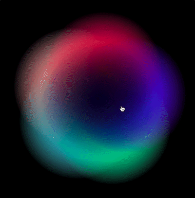
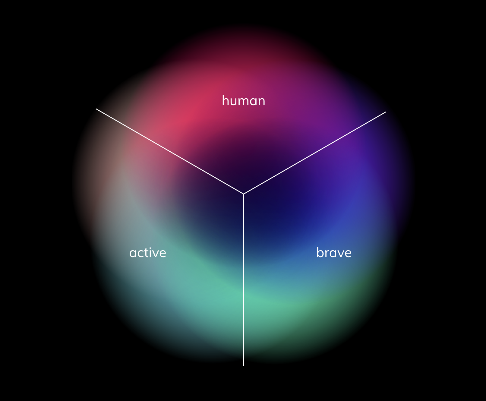

# [Ginetta Iris](https://ginetta.github.io/ginetta-iris/)

## A tool to visualize and generate Ginetta's colors

## Light and bright pink

To represent the «human» dimension, light and bright pink will be mainly used. This part of the color wheel is reminiscent of Ginetta’s «warm, authentic, approachable» side.

## Bright purple

To represent the «brave» dimension, the bright purple will be mainly used. This part of the color wheel is reminiscent of the «sharp, resilient, daring» side of Ginetta.

## Bright green and light blue

To represent the «active» dimension, bright green and light blue will be mainly used. This part of the color wheel is reminiscent of Ginetta’s «agile, growth, continuous» side.

# Available Scripts

In the project directory, you can run:

### `npm start`

Runs the app in the development mode. 
Open <http://localhost:3000> to view it in the browser.

The page will reload if you make edits. 
You will also see any lint errors in the console.

### `npm run build`

Builds the app for production to the `build` folder. 
It correctly bundles React in production mode and optimizes the build for the best performance.

The build is minified and the filenames include the hashes. 

### `npm run deploy`

Runs build and publish it to github pages to <https://ginetta.github.io/ginetta-iris/>

> This project was bootstrapped with [Create React App](https://github.com/facebook/create-react-app).
